## Grupo:

### - Rafael dos Santos Torres - 2023000093

### - Natan da Silva Magalhães - 2023000135

## Professor: Sérgio Monteiro, DSc

``` r
library('quantmod')
```

    ## Carregando pacotes exigidos: xts

    ## Carregando pacotes exigidos: zoo

    ## 
    ## Anexando pacote: 'zoo'

    ## Os seguintes objetos são mascarados por 'package:base':
    ## 
    ##     as.Date, as.Date.numeric

    ## Carregando pacotes exigidos: TTR

    ## Registered S3 method overwritten by 'quantmod':
    ##   method            from
    ##   as.zoo.data.frame zoo

``` r
library('TTR')
library('forecast')
library('prophet')
```

    ## Carregando pacotes exigidos: Rcpp

    ## Carregando pacotes exigidos: rlang

``` r
library(dplyr)
```

    ## 
    ## ######################### Warning from 'xts' package ##########################
    ## #                                                                             #
    ## # The dplyr lag() function breaks how base R's lag() function is supposed to  #
    ## # work, which breaks lag(my_xts). Calls to lag(my_xts) that you type or       #
    ## # source() into this session won't work correctly.                            #
    ## #                                                                             #
    ## # Use stats::lag() to make sure you're not using dplyr::lag(), or you can add #
    ## # conflictRules('dplyr', exclude = 'lag') to your .Rprofile to stop           #
    ## # dplyr from breaking base R's lag() function.                                #
    ## #                                                                             #
    ## # Code in packages is not affected. It's protected by R's namespace mechanism #
    ## # Set `options(xts.warn_dplyr_breaks_lag = FALSE)` to suppress this warning.  #
    ## #                                                                             #
    ## ###############################################################################

    ## 
    ## Anexando pacote: 'dplyr'

    ## Os seguintes objetos são mascarados por 'package:xts':
    ## 
    ##     first, last

    ## Os seguintes objetos são mascarados por 'package:stats':
    ## 
    ##     filter, lag

    ## Os seguintes objetos são mascarados por 'package:base':
    ## 
    ##     intersect, setdiff, setequal, union

``` r
library("MASS")
```

    ## 
    ## Anexando pacote: 'MASS'

    ## O seguinte objeto é mascarado por 'package:dplyr':
    ## 
    ##     select

``` r
require(xgboost)
```

    ## Carregando pacotes exigidos: xgboost

    ## 
    ## Anexando pacote: 'xgboost'

    ## O seguinte objeto é mascarado por 'package:dplyr':
    ## 
    ##     slice

``` r
library(Metrics)
```

    ## 
    ## Anexando pacote: 'Metrics'

    ## O seguinte objeto é mascarado por 'package:rlang':
    ## 
    ##     ll

    ## O seguinte objeto é mascarado por 'package:forecast':
    ## 
    ##     accuracy

``` r
library(pastecs)
```

    ## 
    ## Anexando pacote: 'pastecs'

    ## Os seguintes objetos são mascarados por 'package:dplyr':
    ## 
    ##     first, last

    ## Os seguintes objetos são mascarados por 'package:xts':
    ## 
    ##     first, last

``` r
options(scipen=999)
```

``` r
getSymbols('PETR4.SA', src='yahoo')
```

    ## [1] "PETR4.SA"

Para essa análise, vamos considerar o valor de Fechamento
(PETR4.SA.Close) como a variável alvo. Como a mediana e a média são
valores muito próximos, podemos inferir que os dados possuem uma
distribuição simétrica em torno da média.

``` r
stat.desc(PETR4.SA$PETR4.SA.Close, norm=TRUE)
```

    ##                       PETR4.SA.Close
    ## nbr.val        4305.0000000000000000
    ## nbr.null          0.0000000000000000
    ## nbr.na            0.0000000000000000
    ## min               4.1999998092651367
    ## max              52.5099983215332031
    ## range            48.3099985122680664
    ## sum          102045.2320146560668945
    ## median           23.6399993896484375
    ## mean             23.7038866468422924
    ## SE.mean           0.1294905554733715
    ## CI.mean.0.95      0.2538682171790857
    ## var              72.1853960340339142
    ## std.dev           8.4961989168117942
    ## coef.var          0.3584306254663774
    ## skewness          0.1559504707611750
    ## skew.2SE          2.0893870234185612
    ## kurtosis         -0.2199580738589728
    ## kurt.2SE         -1.4738144470004153
    ## normtest.W        0.9948516285395383
    ## normtest.p        0.0000000000321062

``` r
chartSeries(PETR4.SA, subset = 'last 1 year')
```

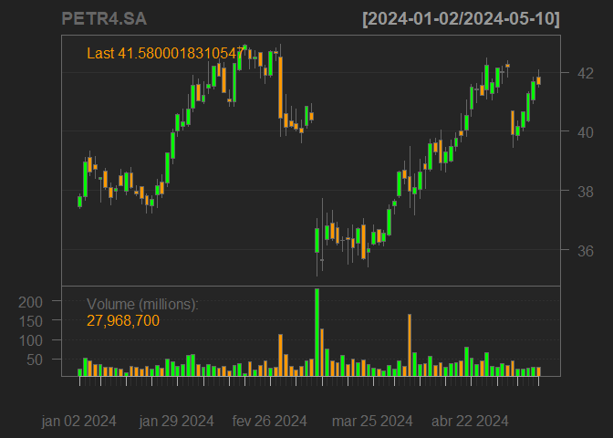

``` r
addBBands()
```

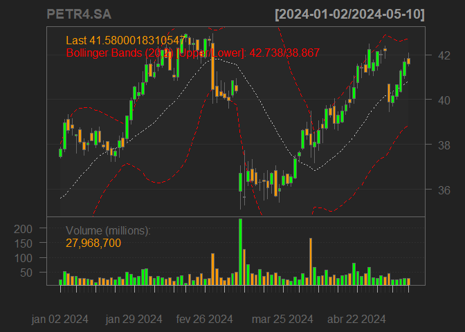

``` r
addSMA()
```

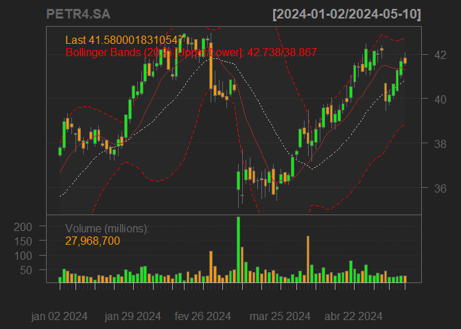

``` r
addMACD()
```

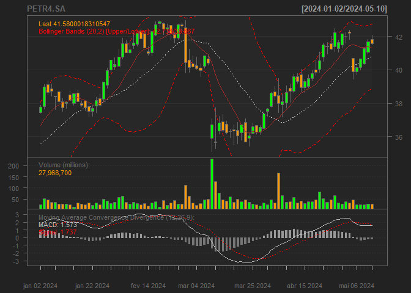 Com o
histograme e gráfico KDE abaixo, podemos verificar que os valores da
série temporal seguem uma distribuição normal, o que significa que os as
ações da PETR4 vão girar em torno do valor da média (que nesse caso é
23,70). Quando os valores das ações estiverem muito acima da média, eles
terão uma tendência a cair, e, da mesma maneira, quando os valores
estiverem muito abaixo, a tendencia sera um novo crescimento.

``` r
hist(PETR4.SA$PETR4.SA.Close, main='Close', xlab = 'Close', labels=TRUE)
```

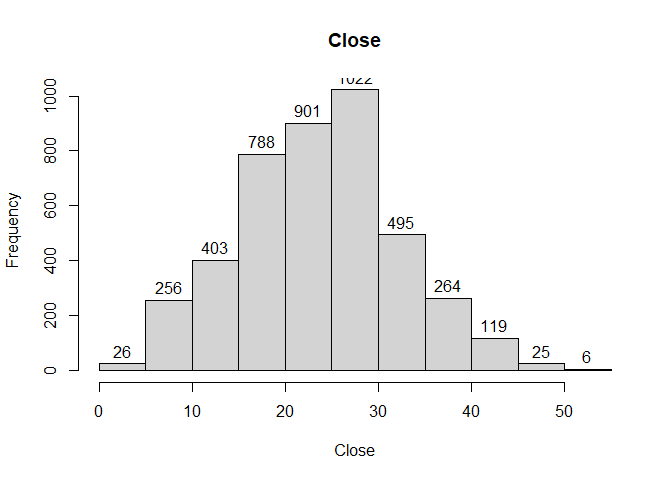

``` r
plot(density(PETR4.SA$PETR4.SA.Close))
```

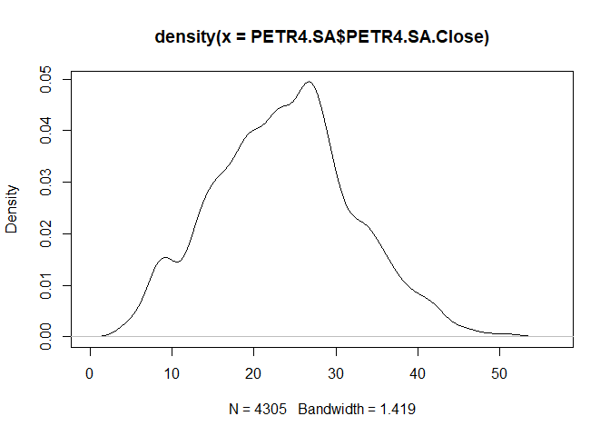

``` r
lineChart(PETR4.SA$PETR4.SA.Close)
```

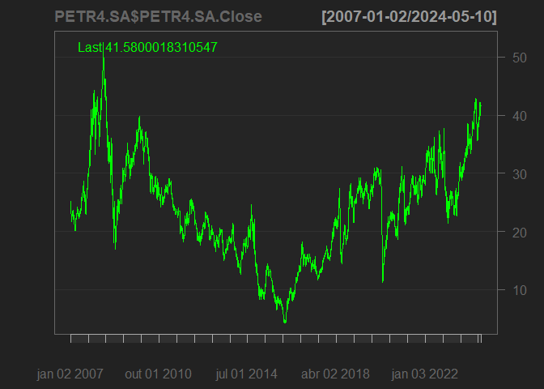

``` r
addEMA(n=365)
```

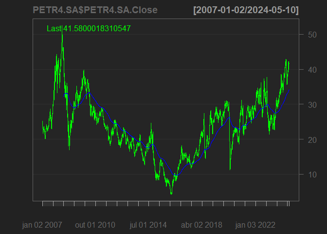

``` r
date = '2024-04'
```

``` r
plot(PETR4.SA[date]$PETR4.SA.Close)
```

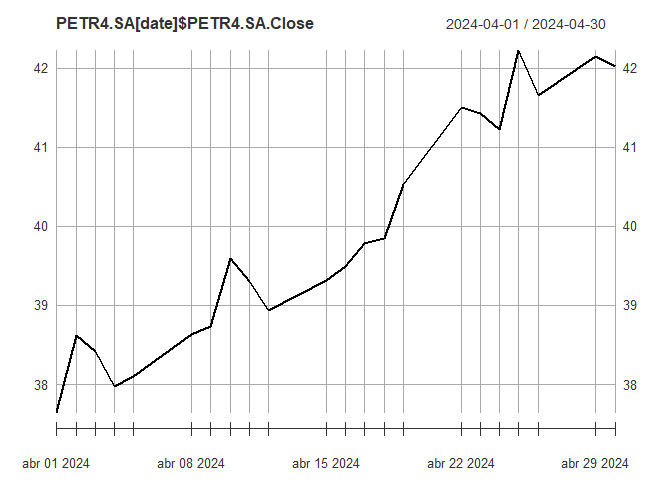

``` r
plot(rollmean(PETR4.SA[date]$PETR4.SA.Close, k=7))
```

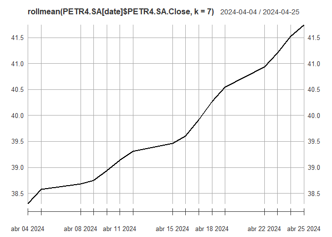

``` r
plot(rollmean(PETR4.SA[date]$PETR4.SA.Close, k=15))
```

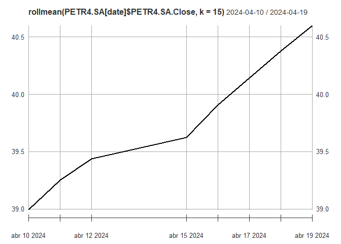 O valor
das ações estão em crescimento contínuo, com valor de mais ou menos 40,
o que supera dois desvios padrões. Como discutido anteriormente, nós
entendemos que a tendência é uma queda dos valores em um futuro próximo.
Para uma melhor análise, vamos conduzir a criação de alguns modelos.

## ARIMA

Primeiro devemos encontrar quantas dferenciações dos dados são
necessárias para que a série temporal se torne estacionária, já que
estacionariedade é um requisito do modelo ARIMA. Com o gráfico abaixo,
podemos verificar que a série se torna estacionário com apenas uma
diferenciação.

``` r
par(mfrow=c(3,1))
plot(PETR4.SA$PETR4.SA.Close)
plot(diff(PETR4.SA$PETR4.SA.Close))
plot(diff(diff(PETR4.SA$PETR4.SA.Close)))
```

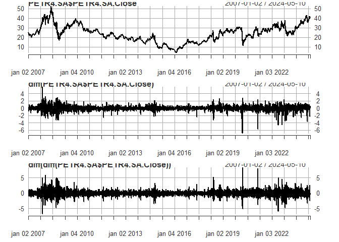

O gráfico ACF mostra a autocorrelação da série com determinados valores
de lag.

``` r
acf(diff(PETR4.SA$PETR4.SA.Close), na.action = na.pass)
```

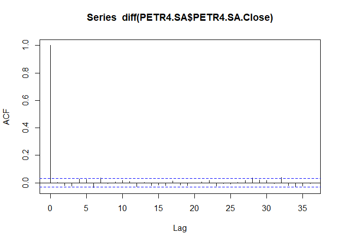 PACF
mostra o quanto a autocorrelação da série pode ser explicada por
consecutivos valores de lag.

``` r
pacf(diff(PETR4.SA$PETR4.SA.Close), na.action = na.pass)
```

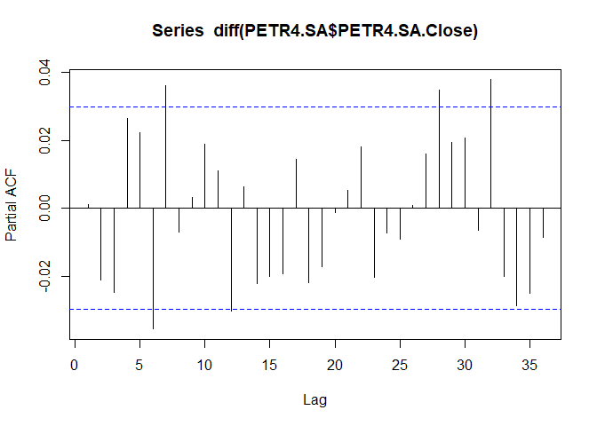
Escolhemos auto.arima para criar o modelo, já que ele decide de maneira
autônoma os melhores valores para os parêmtros AR, I e MA.

``` r
train_date = '/2023'
test_date = '2024'
model = auto.arima(PETR4.SA[train_date]$PETR4.SA.Close)
checkresiduals(model)
```

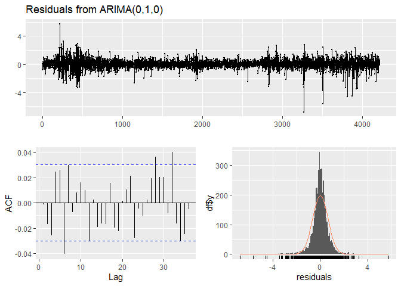

    ## 
    ##  Ljung-Box test
    ## 
    ## data:  Residuals from ARIMA(0,1,0)
    ## Q* = 21.746, df = 10, p-value = 0.01645
    ## 
    ## Model df: 0.   Total lags used: 10

``` r
pred = forecast(model, h = length(PETR4.SA[test_date]$PETR4.SA.Close))
autoplot(pred)
```

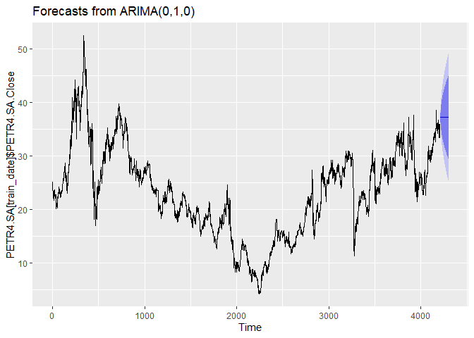 O modelo
auto.arima escolheu os parâmetros AR = 0, I = 1 e MA = 0, o que resulta
em um simples Random Walk, o que significa que nosso modelo não é melhor
do que tentar advinhar valores aleatoriamente.

## Prophet

Com isso, optamos por tentar também o modelo Prophet do Facebook.
Primeiro, precisamos de um Dataframe com as colunas ds (com as datas) e
a coluna y (com os valores a serem predizidos).

``` r
df_for_prophet = data.frame(
  ds = index(PETR4.SA),
  y = PETR4.SA$PETR4.SA.Close
)
names(df_for_prophet) = c('ds', 'y')
```

``` r
prophet_model = prophet(df_for_prophet, daily.seasonality = TRUE)
```

Previsão para os próximos 120 dias.

``` r
future = make_future_dataframe(prophet_model, periods=120)
p_forecast = predict(prophet_model, future)
tail(p_forecast[c('ds', 'yhat', 'yhat_lower', 'yhat_upper')])
```

    ##              ds     yhat yhat_lower yhat_upper
    ## 4420 2024-09-02 36.04304   31.53126   40.22734
    ## 4421 2024-09-03 36.07280   31.38248   40.35473
    ## 4422 2024-09-04 36.12519   31.40753   40.22372
    ## 4423 2024-09-05 36.16443   31.45643   40.42915
    ## 4424 2024-09-06 36.14532   31.89538   40.95375
    ## 4425 2024-09-07 36.93671   32.49421   41.52493

O gráfico abaixo mostra o resultado da previsão do nosso modelo Prophet.
Podemos perceber inicialmente que o modelo conseguiu assimilar as
características de ciclos e tendências da série temporal. Além disso, o
modelo indica uma continuação no aumento das ações da PETR4.

``` r
plot(prophet_model, p_forecast)
```

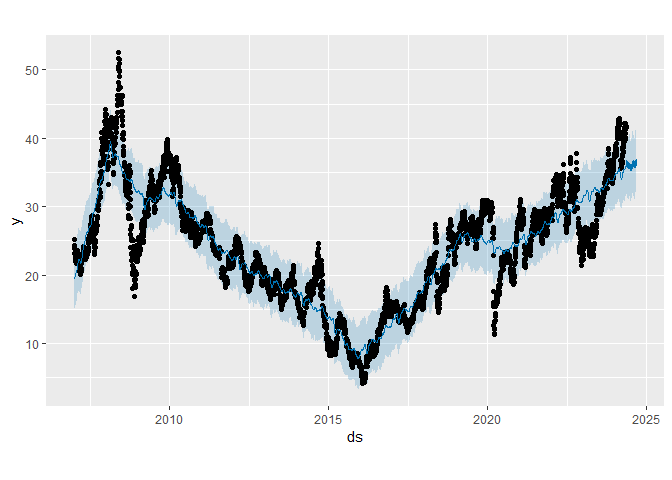

``` r
prophet_plot_components(prophet_model, p_forecast)
```

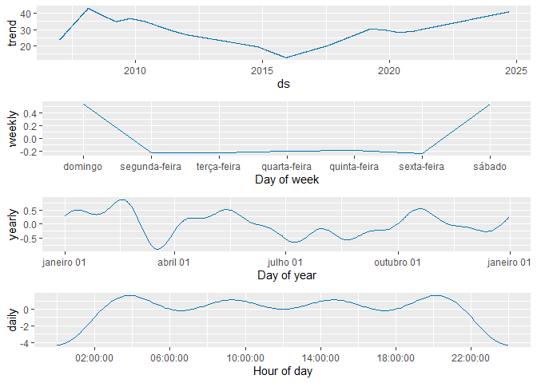

``` r
p_cv = cross_validation(prophet_model, horizon=14, units='days')
```

    ## Making 852 forecasts with cutoffs between 2008-01-04 and 2024-04-26

``` r
performance_metrics(p_cv)
```

    ##   horizon      mse     rmse      mae      mape      mdape     smape  coverage
    ## 1  4 days 12.83388 3.582441 2.711507 0.1401443 0.09493819 0.1389227 0.6435766
    ## 2  5 days 13.28069 3.644268 2.782513 0.1420795 0.09763010 0.1398884 0.6435523
    ## 3  6 days 14.13895 3.760180 2.870590 0.1458640 0.09885261 0.1442744 0.6277641
    ## 4  7 days 14.41331 3.796486 2.920725 0.1501878 0.10246010 0.1488556 0.6126884
    ## 5 10 days 15.76298 3.970261 3.032010 0.1552846 0.10583003 0.1537322 0.6002778
    ## 6 11 days 15.62130 3.952379 3.027491 0.1542465 0.10555374 0.1534726 0.5940747
    ## 7 12 days 16.04934 4.006163 3.073832 0.1551768 0.10664829 0.1532841 0.5839416
    ## 8 13 days 16.89407 4.110240 3.149491 0.1583070 0.10781661 0.1572058 0.5921376
    ## 9 14 days 17.19562 4.146760 3.190602 0.1624386 0.11100865 0.1615609 0.5752116

Como métrica para o resultado do modelo Prophet, temos um MSE de
17.00217 para uma predição com um horizonte de 14 dias.

## Linear Regression

Agora vamos tentar um modelo linear.

``` r
PETR4.SA$Preco_Proximo_Dia <- lead(PETR4.SA$PETR4.SA.Close)
dados_treino <- PETR4.SA["2022-01-01/2023-12-31", ]
dados_teste <- PETR4.SA["2024-01-01/2024-12-31", ]
```

``` r
modelo_lm <- lm(Preco_Proximo_Dia ~ PETR4.SA.Close + PETR4.SA.Open + PETR4.SA.High + PETR4.SA.Low + PETR4.SA.Volume + PETR4.SA.Adjusted, data = dados_treino)
```

``` r
summary(modelo_lm)
```

    ## 
    ## Call:
    ## lm(formula = Preco_Proximo_Dia ~ PETR4.SA.Close + PETR4.SA.Open + 
    ##     PETR4.SA.High + PETR4.SA.Low + PETR4.SA.Volume + PETR4.SA.Adjusted, 
    ##     data = dados_treino)
    ## 
    ## Residuals:
    ##     Min      1Q  Median      3Q     Max 
    ## -4.4648 -0.3643  0.0276  0.4589  2.5602 
    ## 
    ## Coefficients:
    ##                          Estimate      Std. Error t value             Pr(>|t|)
    ## (Intercept)        0.789056939949  0.292586826365   2.697              0.00724
    ## PETR4.SA.Close     1.323804096148  0.144900576730   9.136 < 0.0000000000000002
    ## PETR4.SA.Open      0.189592922182  0.134898318686   1.405              0.16052
    ## PETR4.SA.High     -0.125794472729  0.170981454885  -0.736              0.46225
    ## PETR4.SA.Low      -0.410660770302  0.182048352024  -2.256              0.02452
    ## PETR4.SA.Volume   -0.000000003795  0.000000001573  -2.412              0.01622
    ## PETR4.SA.Adjusted  0.002380462658  0.007213238242   0.330              0.74153
    ##                      
    ## (Intercept)       ** 
    ## PETR4.SA.Close    ***
    ## PETR4.SA.Open        
    ## PETR4.SA.High        
    ## PETR4.SA.Low      *  
    ## PETR4.SA.Volume   *  
    ## PETR4.SA.Adjusted    
    ## ---
    ## Signif. codes:  0 '***' 0.001 '**' 0.01 '*' 0.05 '.' 0.1 ' ' 1
    ## 
    ## Residual standard error: 0.7883 on 491 degrees of freedom
    ## Multiple R-squared:  0.9599, Adjusted R-squared:  0.9595 
    ## F-statistic:  1961 on 6 and 491 DF,  p-value: < 0.00000000000000022

Com um valor de R-Squared próximo a 1, temos um indicativo de que o
modelo consegue explicar a maior parte da variância dos dados.

``` r
lm_pred <- predict(modelo_lm, newdata = dados_teste[,0:6])
xts_test = xts(lm_pred, order.by=index(dados_teste))
plot(dados_teste[,7], col='green')
```

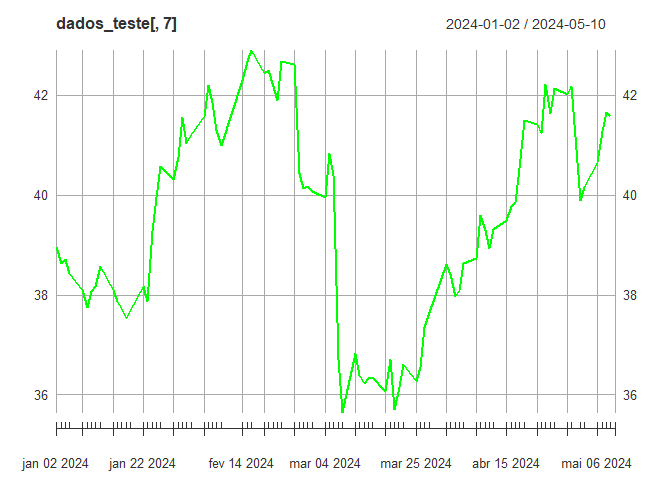

``` r
lines(xts_test, col='red')
```

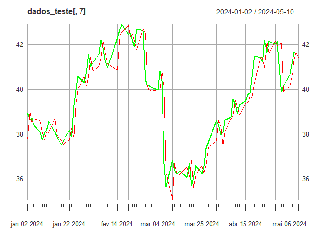 \##
XGBOOST

``` r
xgb_model = xgboost(data = dados_treino[,0:6], label = dados_treino[,7], nrounds = 1000, verbose=0 )
```

``` r
xgb_pred = predict(xgb_model, newdata = dados_teste[,0:6])
xgb_pred_xts = xts(xgb_pred, order.by=index(dados_teste))
```

``` r
plot(dados_teste[,7], col='green')
```


``` r
lines(xts_test, col='red')
```


``` r
lines(xgb_pred_xts, col='yellow')
```

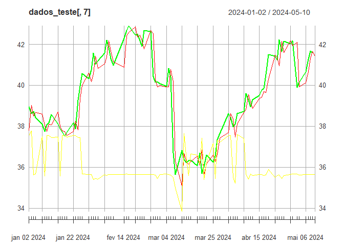 \##
Considerações finais

``` r
mse_custom = function(facts, pred){
  return (mean((as.vector(facts) - as.vector(pred))^2, na.rm=TRUE))
}
```

``` r
paste('MSE Linear Regression', mse_custom(dados_teste$Preco_Proximo_Dia, xts_test))
```

    ## [1] "MSE Linear Regression 0.553868105192962"

``` r
paste('MSE XGBoost', mse_custom(dados_teste$Preco_Proximo_Dia, xgb_pred_xts))
```

    ## [1] "MSE XGBoost 18.0757963702273"

Considerando os resultados obtidos, podemos selecionar o modelo de
Regressão Linear como o que obteve melhor resultado de acordo com a
métrica MSE. Porém, tendo em vista a diferença entre os outros modelos,
e também como o modelo segue de maneira muito próxima os dados
originais, suspeitamos de um possível vazamento de dados, o que acarreta
em overfitting. Com isso, temos que o modelo Prophet, no momento, é o
mais confiável.
